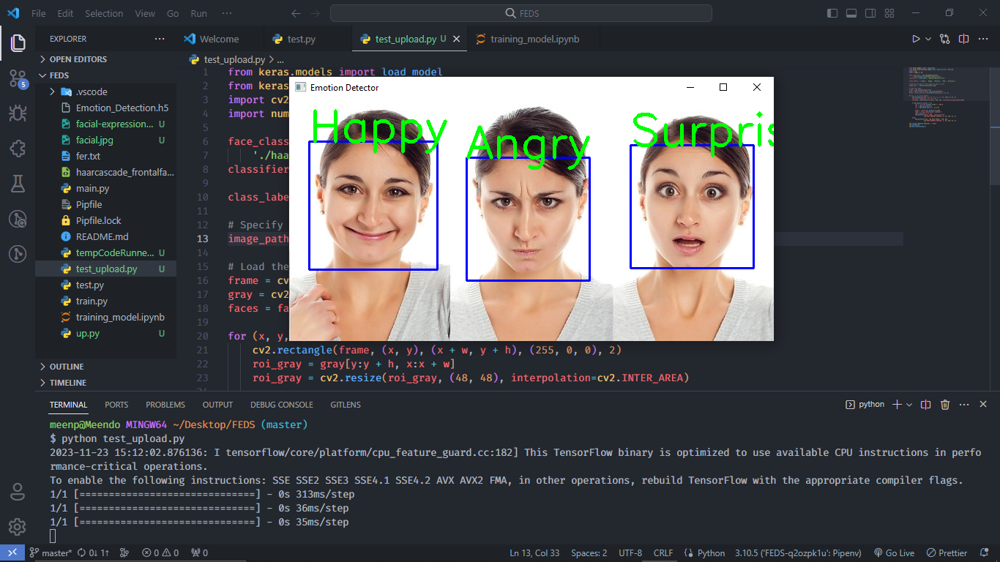
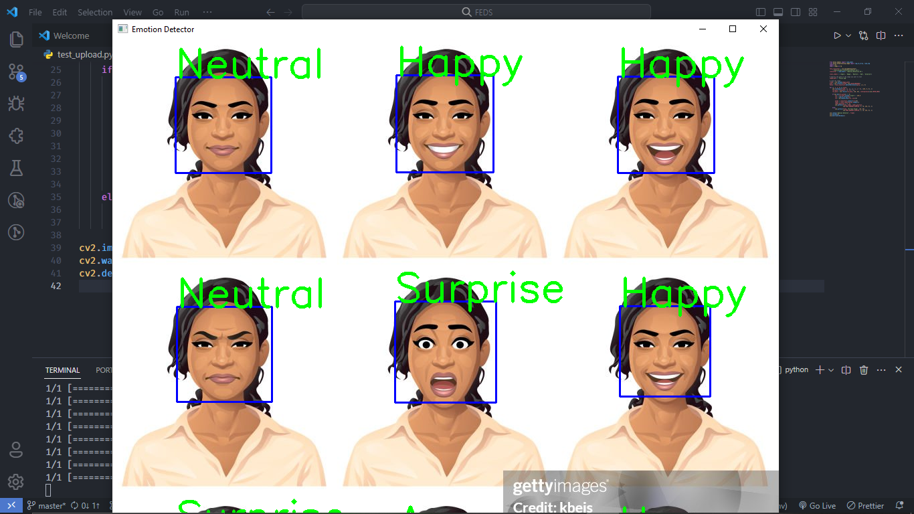

# Facial Expression Recognition System

This repository contain facial expression using cnn, you can also use webcam as realtime facial expression detection

# Introduction

In this project, Artificial Intelligence was employed to detect and classify facial expressions. Various expressions such as happiness, sadness, and anger significantly impact the interpretation of human emotions, and manual analysis of these facial features can be time-consuming and laborious. To address this challenge, a Convolutional Neural Network (CNN) architecture was implemented for the recognition of facial expressions.

The dataset for training the model initially consisted of diverse facial expression images collected from various sources on the internet. Recognizing the importance of data quantity in training robust models, a technique known as Data Augmentation was employed to artificially expand the dataset. This not only increased the dataset size but also helped mitigate overfitting issues in the model.

The culmination of these efforts resulted in the creation of a Deep Learning Model capable of accurately detecting and classifying facial expressions, achieving an impressive test accuracy of 91%. This FER system is poised to contribute significantly to applications such as emotion analysis, human-computer interaction, and other fields where understanding facial expressions is crucial.

# Dataset

**Link to fer-2013 dataset** - [fer-2013] (https://www.kaggle.com/c/challenges-in-representation-learning-facial-expression-recognition-challenge/data)

To train and evaluate the FER system, we use the [fer-2013](https://www.kaggle.com/c/challenges-in-representation-learning-facial-expression-recognition-challenge/data) dataset. This dataset consists of 48x48 pixel grayscale images of faces, labeled with one of seven facial expressions: Angry, Disgust, Fear, Happy, Sad, Surprise, and Neutral. Please download the dataset and place it in the appropriate directory before running the system.

## Demo of FER system

_Here is the demo of the FER system._

## Requirements

The FER system leverages several powerful Python libraries. Make sure you have them installed before using the system:

- **NumPy**: Fundamental package for scientific computing with Python.
- **Pandas**: Data manipulation and analysis library.
- **Matplotlib**: Data visualization library.
- **TensorFlow**: Open-source machine learning framework.
- **Keras**: High-level neural networks API (integrated with TensorFlow).
- **OpenCV**: Open Source Computer Vision Library.
- **Scikit-learn**: Machine learning library for classical algorithms.

Install these libraries using one of the following command:

    `pip install numpy pandas matplotlib tensorflow opencv-python scikit-learn`

OR

    `pipenv install numpy pandas matplotlib tensorflow opencv-python scikit-learn`

## Installation Instructions

1.  Clone the repository:

        `git clone https://github.com/meenphilip/Facial-Expression-Recognition-System.git`

2.  Navigate to the project directory:

        `cd Facial-Expression-Recognition-System`

3.  Install the required Python libraries (consider using a virtual environment):

        ` pip install numpy pandas matplotlib tensorflow opencv-python scikit-learn`

    OR

         `pipenv install numpy pandas matplotlib tensorflow opencv-python scikit-learn`

4.  Download the fer-2013 dataset and place it in the media directory within the project.
5.  Run the FER system:

    1. Static/ uploaded image functionality run:
       ` python upload.py`

    2. Camera/ live image functionality run:
       ` python test.py`

## Usage

To train the model use the following command:

    ` python train.py`

The model can make predictions on saved images by providing the image path using the following command:

    ` python upload.py`

It can also predict on saved videos:

      ` python upload.py`

Or by using a live camera:

    ` python upload.py`

Here are some test examples:

